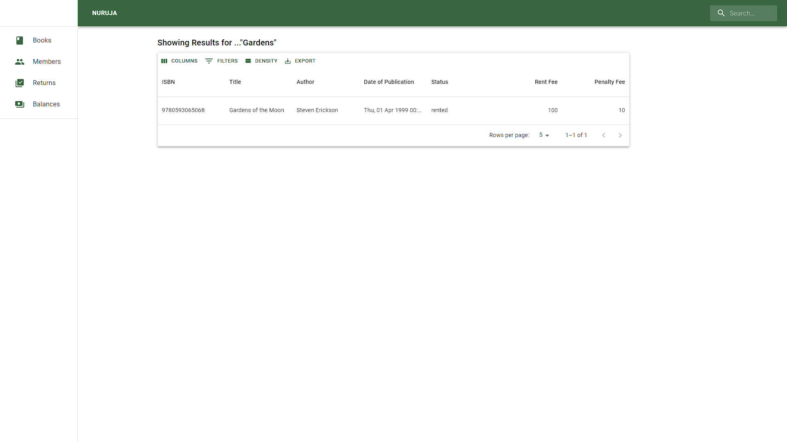

# Nuruja (frontend)

> This is a simple Library Management System that allows one to add a book, add a member, lend a book to a member,
> initiate
> a book return, charge a rent fee, a late penalty fees, as well as manage members' balances.
> Live demo [_hence_](https://nuruja.vercel.app)

## Table of Contents

* [Technologies Used](#technologies-used)
    * [Front-End](#front-end)
    * [Backend](#backend)
* [Features](#features)
* [Screenshots](#screenshots)
    * [Books View](#books-view)
    * [Edit Book View](#edit-book-view)
    * [Members View](#members-view)
    * [Edit Member View](#edit-member-view)
    * [Rent a Book View](#rent-a-book-view)
    * [Pending Returns View](#pending-returns-view)
    * [Member Balances View](#member-balances-view)
    * [Not Found View](#not-found-view)
    * [Failed Connection View](#failed-connection-view)
    * [Search View](#search-view)
* [Setup](#setup)
* [Project Status](#project-status)
* [Room for Improvement](#room-for-improvement)
* [Contact](#contact)

## Technologies Used

### Front-End

- [JavaScript](https://en.wikipedia.org/wiki/JavaScript)
- [React](https://react.dev/), and [Material UI](https://mui.com/)

### Backend

- [Python](https://www.python.org/)
- [Flask](https://flask.palletsprojects.com/en/2.3.x/)
- [PostgreSQL](https://www.postgresql.org/)

## Features

The following are the features of the web application:

- add, edit, and remove a Book
- add, edit, and remove a Member
- rent a Book to a Member charging a rent fee as well as a late penalty fee after two weeks

## Screenshots

### Books View


### Edit Book View


### Members View


### Edit Member View


### Rent a Book View


### Pending Returns View


### Member Balances View


### Not Found View


### Failed Connection View


### Search View



## Setup

To run the application locally, first follow the [steps](https://github.com/GichanaMayaka/nuruja/#readme) for setting up
the backend. Once the backend is up and running, supply a _.env_ to the repository root with the configuration as below:

```bash
REACT_APP_API_ENDPOINT=[hostname:[port]]
```

To create the environment and run the development server:

```bash
npm install

npm start
```

## Project Status

Project is: _in progress_.

## Room for Improvement

The following are areas I intend to implement going forward

- Add security, authentication and user roles.

## Contact

Created by [Gichana Mayaka](mailto://gichanamayaka@gmail.com) - feel free to contact me!
